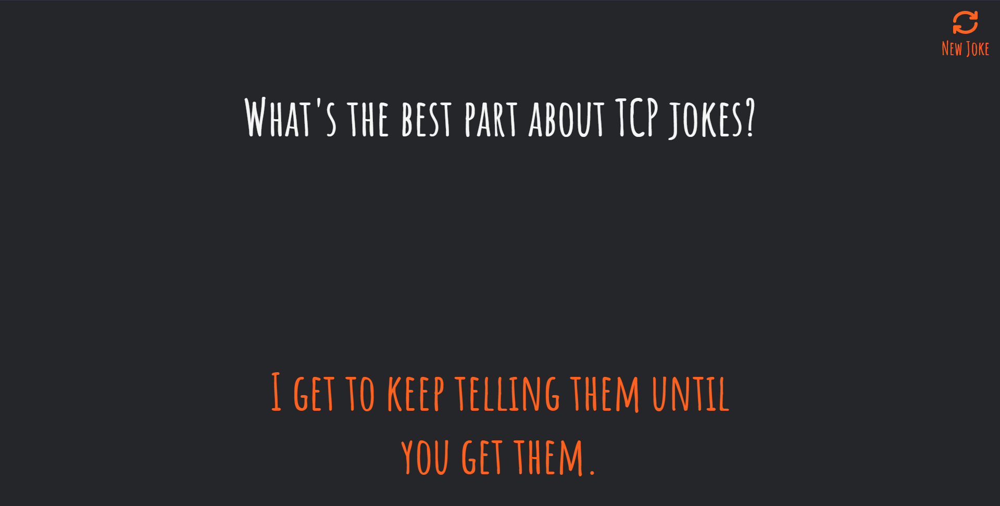

# Made Using React.js

Check it out - https://yq-joke-gen.netlify.app/

### API

https://github.com/15Dkatz/official_joke_api

### Deployed Using

- Frontend (Netlify)
- Backend-API (Heroku)

### Screenshots

